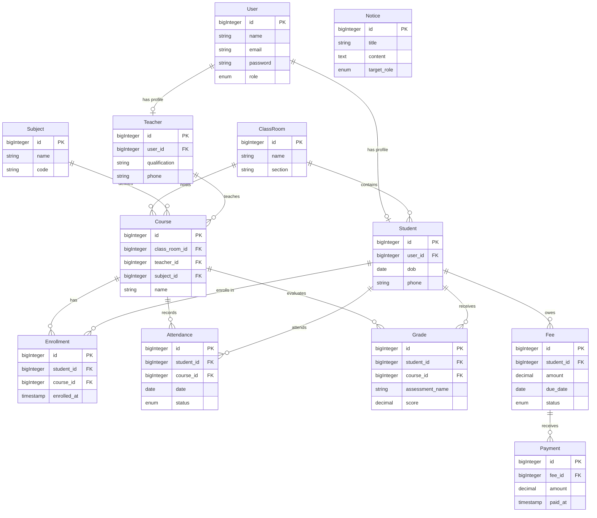

# Entity Relationship Diagram

# Migration Plan

1.  **Users Table**: Already exists (default Laravel). Add `role` column.
2.  **ClassRooms & Subjects**: Create these independent tables first.
3.  **Students & Teachers**: Create these, linking to `users`. `students` may link to `class_rooms`.
4.  **Courses**: Create, linking to `class_rooms`, `teachers`, and `subjects`.
5.  **Enrollments**: Pivot/Link table for `students` and `courses`.
6.  **Academic Records**: Create `attendances` and `grades`, linking to `students` and `courses`.
7.  **Financials**: Create `fees` (linked to `students`) and `payments` (linked to `fees`).
8.  **Notices**: Independent table.
